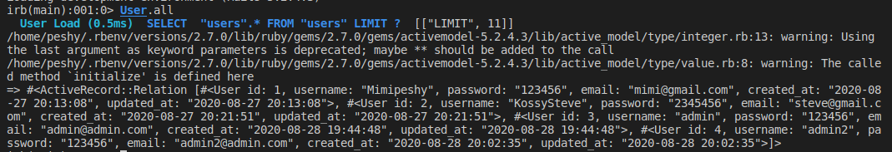

## reddit_clone
This is a microverse rails project to to work with database and model interactions and associations

## Code execution view:




 

## Built With
Ruby on Rails
VsCode
Active Records

## Getting Started
To get a local copy up and running follow these simple example steps:

```
Clone this repository into your local machine.
https://github.com/KossySteve/redditt_clone.git
cd redditt_clone
git checkout development

```

## Usage
Open a new terminal and type

```python
 $ rails console

 $ u = User.new(username: 'Admin', email: 'admin@admin.com', password: '123456') #This is to create a User
 $ p = Post.new(title:'new title', body: 'New body', user_id: 1) #This is to create a post by a certain user
 $ c = Comment.new(title: 'New comment',body: 'New body', user_id: 1,  post_id: 1) #This is to create a comment by the user
 $ u.save
 $ p.save
 $ c.save
 $ u #To check the user content
 $ p #To check the post content
 $ c #To check the comment content
```
## Validators
Rubocop
Stickler

## Authors
👤 **Ezeokwelume Stephen Kosisochukwu**

- Github: [KossySteve](https://github.com/KossySteve)
- Linkedin: [Kossy Steve](https://www.linkedin.com/in/steve-ez-b090ba198/)

👤 **Peris Ndanu**

- Github: [mimipeshy](https://github.com/mimipeshy)
- Linkedin: [Peris Ndanu](https://www.linkedin.com/in/peris-ndanu-405083193/)

## 🤝 Contributing

Contributions, issues and feature requests are welcome!

Feel free to check the [issues page](issues/).

## Show your support

Give a ⭐️ if you like this project!

## 📝 License

This project is [MIT](lic.url) licensed.

